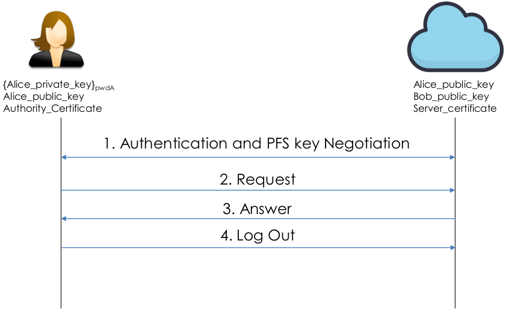

# Secure-Cloud-Storage
**Foundations of Cybersecurity** course project (MSc in Computer Engineering @ Unversity of Pisa). Design and Implementation of a ***Secure Cloud Storage application*** by using **C++** and **OpenSSL** cryptographic library.

The project was developed by using **C++17**, and the implementation of cryptographic protocols was realized through the **OpenSSL Version 1.1.1 library**. Communication aspects were established using POSIX sockets.
</br></br>


## Table of Contents
1. [Programming Languages and Tools](#programming-languages-and-tools)
2. [Project Specifications](#project-specifications)
    + [General Description](#general-description)
    + [Pre-Shared Crypto Material](#pre-shared-crypto-material)
    + [Requirements](#requirements)
    + [Operations Provided](#operations-provided)
3. [Project Description](#project-description)
    + [Design Choices](#design-choices)
    + [Exchanged Messages](#exchanged-messages)
      - [Generic Message](#generic-message)
      - [Simple Message](#simple-message)
    + [Communication Protocols](#communication-protocols)
4. [Project Structure](#project-structure)

</br></br>


## Programming Languages and Tools
<p align="center">
	
	<a href= https://www.jetbrains.com/clion/ target="_blank" rel="noreferrer">
  		
	</a>
	<a href="https://www.openssl.org/" target="_blank" rel="noreferrer">
		
	</a>
</p>
</br></br>


## Project Specifications

### General Description
The project implements a **Client-Server application** that resembles a **Cloud Storage**. Each user has a “dedicated storage” on the server, and User A cannot access User B “dedicated storage” Users can *Upload, Download, Rename, or Delete* data to/from the Cloud Storage in a **safe manner**.

<p align="center">
	
</p>
</br></br>

### Pre-Shared Crypto Material
- **Users**:
	+ CA certificate
	+ Long-term RSA key-pair
	+ Long-term private key is password protected
- **Server**:
	+ Its own certificate signd by a CA
	+ Knows the username of every registered user
	+ Knows the RSA public key of every user
</br></br>


### Requirements
1. The negotiation must provide **Perfect Forward Secrecy**.
2. The entire session must be **encrypted and authenticated**.
3. The entire session must be protected against **replay attacks**.
</br></br>


### Operations Provided:
- **Upload**: Specifies a filename on the client machine and sends it to the server. The server
saves the uploaded file with the filename specified by the user.
- **Download**: Specifies a file on the server machine. The server sends the requested file to the user
- **Delete**: Specifies a file on the server machine. The server asks the user for confirmation. If the user confirms, the file is deleted from the server.
- **List**: The client asks to the server the list of the filenames of the available files in his dedicated storage. The client prints to screen the list.
- **Rename**: Specifies a file on the server machine. Within the request, the clients sends the new filename.
- **LogOut**: The client gracefully closes the connection with the server.
</br></br>


## Project Description

### Design Choices

The Design choices to guarantee security requirements are as follows.

1. **Perfect Forward Secrecy**: the authentication phase employs the ***Station-to-Station protocol***, leveraging the ephemeral ***Diffie-Hellman Key Exchange***. Upon successful negotiation, both entities possess a ***shared 128-bit session key***, derived using the ***SHA256 algorithm***. This session key serves as the foundation for subsequent encrypted message exchanges.

2. **Message Encryption and Authentication**: the chosen
approach involves employing the ***AES algorithm with a 128-bit key*** and ***GCM (Galois Counter Mode)*** encryption method. This strategic selection ensures the simultaneous provision of robust block encryption and message authentication.

3. **Protection against Replay Attacks**: The use of GCM contributes to the protocol’s resilience against replay attacks. This is achieved through the utilization of a ***counter within the Additional Authenticated Data (AAD) field***, specifically designed to keep track of the messages sent. This prevents unauthorized replay of previously transmitted messages.
</br></br>


### Exchanged Messages

#### Generic Message
All messages exchanged during the session between the client and server are encapsulated within a Generic message. This message contains fields of fixed size (IV, AAD, and TAG) transmitted in plain text, along with a variable-length ciphertext.

- **IV**: used by the AES GCM algorithm to initialize the operation, and a different IV is used for each encryption. The default size is ***12 bytes (96 bits)***.

- **AAD (Additional Authenticated Data)**: Contains data that is authenticated but not encrypted. In this case, it contains the ***32-bit (4 bytes)*** counter that keeps track of the current message number (incremented with each send or receive).

- **TAG**: serves as a cryptographic checksum. It is generated during the encryption process and is used for data integrity verification during decryption (is computed based on the ciphertext, the AAD, and the IV). Its size is ***128 bits (16 bytes)***. Is used during decryption phase and it is compared with the received one to ensure the integrity of the encrypted data.

- **Chiphertext**: Is obtained from the encryption of a serialized message, and its lenght depends on the size of the plaintext.

<p align="center">
	
</p>
</br></br>


#### Simple Message
In many cases, however, it is necessary to send only a message code to specify the operation to be executed, or to send an ACK/NACK. For this reason, a standard message called ***SimpleMessage*** has been created.

This message consists of a message ***code (1 byte)*** indicating the type or outcome of an operation and ***70 other random bytes***.

<p align="center">
	
</p>
</br></br>


### Communication Protocols

Check the documentation to see the complete communication schemes for each operation. It includes details about the message content and the actions performed on both the client and server sides.

The communication schemes are the following:
- **Authentication Operation**
- **Upload Operation**
- **Download Operation**
- **Delete Operation**
- **List Operation**
- **Rename Operation**
- **Logout Operation**
</br></br>


## Project Structure
```
Secure-Cloud-Storage
├── data
│   ├── Francesco
│   ├── Luca
│   └── Salvatore
├── documents
│   ├── images
│   └── Secure_Cloud_Storage.pdf
├── files
│   ├── empty_file
│   ├── sample.md
│   └── sample.txt
├── resources
│   ├── certificates
│   │   ├── CA_cert.pem
│   │   ├── CA_crl.pem
│   │   ├── Francesco_cert.pem
│   │   ├── Luca_cert.pem
│   │   ├── Salvatore_cert.pem
│   │   └── Server_cert.pem
│   ├── encrypted_private_keys
│   │   ├── Francesco_key.pem
│   │   ├── Luca_key.pem
│   │   ├── Salvatore_key.pem
│   │   └── Server_key.pem
│   ├── private_keys
│   │   ├── Francesco_key.pem
│   │   ├── Luca_key.pem
│   │   ├── Salvatore_key.pem
│   │   └── Server_key.pem
│   └── public_keys
│       ├── Francesco_key.pem
│       ├── Luca_key.pem
│       └── Salvatore_key.pem
├── src
│   ├── crypto
│   │   ├── AesGcm.cpp
│   │   ├── AesGcm.h
│   │   ├── CertificateManager.cpp
│   │   ├── CertificateManager.h
│   │   ├── DiffieHellman.cpp
│   │   ├── DiffieHellman.h
│   │   ├── DigitalSignatureManager.cpp
│   │   ├── DigitalSignatureManager.h
│   │   ├── Hash.cpp
│   │   └── Hash.h
│   ├── messages
│   │   ├── Authentication.cpp
│   │   ├── Authentication.h
│   │   ├── CodesManager.h
│   │   ├── Delete.cpp
│   │   ├── Delete.h
│   │   ├── Download.cpp
│   │   ├── Download.h
│   │   ├── Generic.cpp
│   │   ├── Generic.h
│   │   ├── List.cpp
│   │   ├── List.h
│   │   ├── Rename.cpp
│   │   ├── Rename.h
│   │   ├── SimpleMessage.cpp
│   │   ├── SimpleMessage.h
│   │   ├── Upload.cpp
│   │   └── Upload.h
│   ├── modules
│   │   ├── Client.cpp
│   │   ├── Client.h
│   │   ├── ClientMain.cpp
│   │   ├── Server.cpp
│   │   ├── Server.h
│   │   ├── ServerMain.cpp
│   │   └── ServerMain.h
│   └── utils
│       ├── Config.h
│       ├── ExtractPublicKey.cpp
│       ├── FileManager.cpp
│       ├── FileManager.h
│       ├── SocketManager.cpp
│       └── SocketManager.h
└── test
    ├── AesGcmTest.cpp
    ├── CertificateManagerTest.cpp
    ├── DiffieHellmanTest.cpp
    ├── DigitalSignatureManagerTest.cpp
    ├── FileManagerTest.cpp
    ├── HashTest.cpp
    ├── KeyTest.cpp
    └── SocketManagerTest.cpp
```

</br></br>
